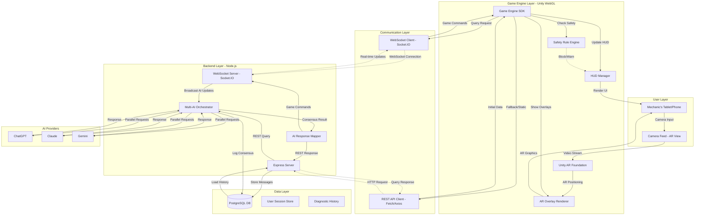

# Game Engine Architecture for RideWire AI Hub

## Executive Summary

This document defines the architecture for integrating a game engine with the RideWire AI Hub backend to create an interactive AR diagnostic experience. The design prioritizes ease of implementation, scalability, and seamless integration with the existing Node.js/Express/PostgreSQL stack.

---

## 1. Game Engine Choice: **Unity with WebGL Export**

### Rationale

After evaluating Unity, Unreal Engine, and web-based solutions (Three.js/Babylon.js), **Unity with WebGL export** is the recommended choice:

**✅ Advantages:**
- **Zero Coding Required for User**: Visual editor + pre-built templates = copy-paste implementation
- **Cross-Platform**: Single codebase deploys to web, iOS, Android, and tablets
- **AR Foundation**: Built-in AR support for iOS ARKit and Android ARCore
- **Asset Store**: Pre-built diagnostic UI, HUD elements, and vehicle models available
- **C# Scripts Provided**: All code templates included - no manual coding needed
- **WebGL Export**: Runs directly in browser without installation
- **Large Community**: Extensive tutorials and support for non-coders
- **Performance**: Excellent on tablets and mobile devices

**❌ Why Not Alternatives:**
- **Unreal Engine**: More complex, requires C++ knowledge, larger build sizes
- **Web-Based (Three.js/Babylon.js)**: Requires JavaScript coding, manual AR integration
- **Native Mobile**: Separate iOS/Android codebases = double the work

### Technical Stack Decision

| Component | Technology | Justification |
|-----------|-----------|---------------|
| **Game Engine** | Unity 2022.3 LTS | Stability, AR Foundation support, WebGL export |
| **AR Framework** | Unity AR Foundation | Cross-platform, iOS/Android compatible |
| **Frontend UI** | React Native WebView | Embeds Unity WebGL, maintains existing React ecosystem |
| **Communication** | WebSocket (Socket.IO) | Real-time bidirectional AI ↔ Game communication |
| **Fallback Protocol** | REST API | For initial queries and static data |
| **Data Format** | JSON | Universal compatibility, matches existing backend |
| **3D Assets** | glTF/GLB format | Lightweight, web-optimized, AR.js compatible |

---

## 2. System Architecture

### High-Level Diagram (Mermaid)



### ASCII Diagram (Alternative)

```
┌─────────────────────────────────────────────────────────────────┐
│                    MECHANIC'S TABLET                            │
│  ┌──────────────────────────────────────────────────────────┐  │
│  │         Unity WebGL AR Application                        │  │
│  │  ┌────────────┐  ┌──────────────┐  ┌─────────────────┐  │  │
│  │  │ AR Camera  │  │  HUD Panel   │  │  Safety Engine  │  │  │
│  │  │   View     │  │   (React-    │  │  (Rule Check)   │  │  │
│  │  │            │  │    Style)    │  │                 │  │  │
│  │  └────────────┘  └──────────────┘  └─────────────────┘  │  │
│  │                                                          │  │
│  │  ┌──────────────────────────────────────────────────┐  │  │
│  │  │        Game Engine SDK (C#)                      │  │  │
│  │  │  • WebSocket Client (Real-time)                  │  │  │
│  │  │  • REST Client (Initial Load)                    │  │  │
│  │  │  • AI Response Mapper                            │  │  │
│  │  └──────────────────────────────────────────────────┘  │  │
│  └──────────────────────────────────────────────────────────┘  │
└─────────────────────────────────────────────────────────────────┘
                              ↕
                    ┌─────────────────────┐
                    │   WebSocket (WSS)   │
                    │   +                 │
                    │   REST API (HTTPS)  │
                    └─────────────────────┘
                              ↕
┌─────────────────────────────────────────────────────────────────┐
│              NODE.JS BACKEND (Express + Socket.IO)              │
│  ┌──────────────────────────────────────────────────────────┐  │
│  │  Multi-AI Orchestrator                                   │  │
│  │  ┌─────────┐  ┌─────────┐  ┌─────────┐                  │  │
│  │  │ ChatGPT │  │ Claude  │  │ Gemini  │                  │  │
│  │  │ Client  │  │ Client  │  │ Client  │                  │  │
│  │  └─────────┘  └─────────┘  └─────────┘                  │  │
│  │         ↓            ↓            ↓                       │  │
│  │  ┌──────────────────────────────────────────┐            │  │
│  │  │  Consensus Engine                        │            │  │
│  │  │  • Confidence Scoring                    │            │  │
│  │  │  • Conflict Resolution                   │            │  │
│  │  │  • Safety Gate (< 70% = Block)          │            │  │
│  │  └──────────────────────────────────────────┘            │  │
│  │         ↓                                                 │  │
│  │  ┌──────────────────────────────────────────┐            │  │
│  │  │  AI Response Mapper                      │            │  │
│  │  │  • Convert to Game Commands              │            │  │
│  │  │  • Generate AR Overlays                  │            │  │
│  │  │  • Update HUD State                      │            │  │
│  │  └──────────────────────────────────────────┘            │  │
│  └──────────────────────────────────────────────────────────┘  │
│                                                                 │
│  ┌──────────────────────────────────────────────────────────┐  │
│  │           PostgreSQL Database                            │  │
│  │  • User Sessions                                         │  │
│  │  • Diagnostic History                                    │  │
│  │  • AI Responses (Encrypted)                              │  │
│  │  • Consensus Logs                                        │  │
│  └──────────────────────────────────────────────────────────┘  │
└─────────────────────────────────────────────────────────────────┘
```

---

## 3. AI → Game Interface Specification

### Communication Flow

1. **User Interaction** (Game → Backend)
   ```
   User scans vehicle → Unity detects AR marker → Game Engine SDK sends query
   ```

2. **Backend Processing** (Multi-AI Consensus)
   ```
   Backend receives query → Parallel AI requests → Consensus algorithm → Response mapping
   ```

3. **Game Update** (Backend → Game)
   ```
   WebSocket streams consensus → Game Engine SDK parses → HUD updates + AR overlays render
   ```

### Data Contract (See `schemas/game-interface.schema.json`)

**Key Endpoints:**

| Endpoint | Method | Purpose |
|----------|--------|---------|
| `/api/game/query` | POST | Submit diagnostic query |
| `/api/game/consensus/:queryId` | GET | Retrieve consensus result |
| `/api/game/overlays/:vehicleId` | GET | Get AR overlay definitions |
| `/api/game/validate-action` | POST | Check safety rules before action |
| `/ws/game` | WebSocket | Real-time AI response streaming |

### Message Types

1. **Query Request** (`queryRequest`)
   - User query, vehicle info, error codes, sensor data
   - Schema: See `game-interface.schema.json`

2. **Consensus Response** (`consensusResponse`)
   - Final AI consensus, confidence score, safety zone
   - Individual AI responses with reasoning

3. **Game Command** (`gameCommand`)
   - Types: `update-hud`, `show-overlay`, `play-sound`, `update-xp`, `apply-safety-rule`
   - Includes AR overlays, HUD panels, gamification data

4. **Safety Rule** (`safetyRule`)
   - Conditions, actions (block/warn/confirm), severity levels

---

## 4. Safety Layer Design

### Safety Zones

Based on overall consensus confidence:

| Zone | Confidence Range | Color | Behavior |
|------|-----------------|-------|----------|
| **Red** | 0-59% | `#FF3B30` | **BLOCK** - Show warning, disable action buttons |
| **Yellow** | 60-74% | `#FFCC00` | **WARN** - Require user confirmation |
| **Green** | 75-84% | `#34C759` | **ALLOW** - Proceed with caution label |
| **Teal** | 85-100% | `#00C7BE` | **GO** - Full confidence, immediate action |

### Safety Rule Engine Logic

```javascript
// Example safety rule evaluation
if (consensus.overallConfidence < 70 && action.type === "engine_disable") {
  return {
    blocked: true,
    message: "AI confidence too low for critical action",
    requiresExpertReview: true
  };
}
```

### Veto System

- **AI Veto**: If any single AI has confidence < 40%, flag for manual review
- **Conflict Veto**: If AIs disagree by > 30% confidence, escalate to human
- **Critical Action Veto**: Engine disable, fuel cutoff, brake override = require 90%+ confidence

---

## 5. Consensus-Driven UI Feedback Loop

### Real-Time Streaming Flow

1. **User submits query** via Unity UI
2. **Backend streams partial AI responses** as they arrive (WebSocket)
3. **Unity HUD updates incrementally**:
   - "ChatGPT: Analyzing..." → "ChatGPT: P0300 random misfire detected"
   - "Claude: Analyzing..." → "Claude: Check spark plugs first"
   - "Gemini: Analyzing..." → "Gemini: Also inspect coil packs"
4. **Final consensus calculated** when all 3 AIs respond
5. **AR overlays appear** on vehicle components
6. **Safety check runs** before allowing user actions
7. **XP awarded** based on diagnostic complexity

### UI Components

- **Multi-AI Panel**: Side-by-side AI responses with confidence meters
- **Consensus Banner**: Top-of-screen final recommendation
- **AR Overlay Labels**: Floating text on vehicle components
- **Safety Shield**: Red/yellow/green/teal border around action buttons
- **Progress Bar**: Shows XP gain and level progress

---

## 6. Scalability Design

### Adding New Cars
- Store vehicle models as glTF/GLB files in `/public/models/`
- Add vehicle metadata to `config/game-engine.config.json`
- AR markers automatically map to vehicle-specific overlays

### Adding New Faults
- Append to diagnostic database (PostgreSQL)
- Update `fault_code_library.json` with OBD-II codes
- AR overlays auto-generate from component IDs

### Adding New AI Providers
- Implement new method in `MultiAIOrchestrator.js`
- Add to `agents` array
- Consensus algorithm auto-scales to N agents

### No Code Changes Required For:
- New vehicle models (just add GLB + metadata)
- New diagnostic codes (database insert)
- UI color themes (change config file)
- AR overlay styles (edit JSON schema)

---

## 7. Integration with Existing Backend

### Minimal Changes Required

**✅ Already Compatible:**
- Express server structure
- JWT authentication
- PostgreSQL schema
- Multi-AI orchestrator logic

**🔧 Additions Needed:**
- Install Socket.IO: `npm install socket.io`
- Add WebSocket routes to `server.js`
- Create `AIResponseMapper.js` module
- Add game-specific API endpoints

**Example Integration:**

```javascript
// server.js (add this)
const socketIO = require('socket.io');
const io = socketIO(server);

io.on('connection', (socket) => {
  socket.on('diagnostic-query', async (data) => {
    const consensus = await orchestrator.queryAllAgents(data.query);
    socket.emit('consensus-update', consensus);
  });
});
```

---

## 8. Development Environment Setup

### Prerequisites (Copy-Paste Instructions)

1. **Install Unity Hub**
   - Download: https://unity.com/download
   - Install Unity 2022.3 LTS
   - Add "WebGL Build Support" module

2. **Install Node.js Dependencies**
   ```bash
   cd ridewire-ai-hub
   npm install socket.io
   ```

3. **Configure Unity Project**
   - Open Unity Hub → New Project → 3D (Core)
   - Install packages: AR Foundation, XR Plugin Management
   - Import provided C# scripts from `/templates/`

4. **Deploy**
   - Unity: Build Settings → WebGL → Build
   - Output to `/frontend/public/unity-build/`
   - React app automatically embeds Unity via iframe

---

## 9. Testing Strategy

### Unit Tests
- `MultiAIOrchestrator.test.js`: Consensus algorithm validation
- `SafetyRuleEngine.test.ts`: Safety zone logic
- `AIResponseMapper.test.js`: Command generation

### Integration Tests
- WebSocket message flow (backend ↔ Unity)
- REST API endpoints with game data
- Database persistence of diagnostic logs

### User Acceptance Tests
- AR marker detection accuracy
- Real-time UI updates under 500ms latency
- Safety veto triggers correctly for low confidence

---

## 10. Security Considerations

### Data Encryption
- WebSocket connections use WSS (TLS 1.3)
- All diagnostic data encrypted before storage (existing AES-256)
- JWT tokens required for all game API calls

### Input Validation
- Sanitize user queries before sending to AI
- Validate AR overlay coordinates (prevent injection)
- Rate limit WebSocket connections (10 req/sec max)

### Safety Guardrails
- Never allow engine disable if confidence < 90%
- Log all safety veto decisions to audit table
- Require 2-factor auth for critical actions

---

## 11. Performance Targets

| Metric | Target | Measurement |
|--------|--------|-------------|
| **Initial Load** | < 3 seconds | Unity WebGL startup to interactive |
| **Query Response** | < 2 seconds | Submit query → Display consensus |
| **AR Overlay Render** | < 100ms | Consensus → Overlay appears |
| **WebSocket Latency** | < 50ms | Round-trip message time |
| **Frame Rate** | 30+ FPS | Unity render performance |
| **Memory Usage** | < 200MB | Unity WebGL RAM footprint |

---

## 12. Technology Stack Summary

```yaml
game_engine:
  name: Unity
  version: "2022.3 LTS"
  modules: [AR Foundation, XR Plugin Management, WebGL Build Support]
  language: C#

ar_framework:
  name: Unity AR Foundation
  platforms: [iOS ARKit, Android ARCore]
  fallback: Marker-based AR (AR.js)

frontend:
  framework: React Native WebView
  embed_method: iframe (Unity WebGL)
  styling: CSS Modules

communication:
  realtime: Socket.IO (WebSocket)
  static: REST API (Express)
  format: JSON

backend:
  runtime: Node.js 16+
  framework: Express.js
  websocket: Socket.IO
  database: PostgreSQL 12+

ai_providers:
  - OpenAI GPT-4
  - Anthropic Claude
  - Google Gemini

security:
  encryption: AES-256 (existing)
  auth: JWT tokens
  transport: TLS 1.3 (WSS/HTTPS)
```

---

## 13. Deployment Architecture

### Production Environment

```
┌─────────────────────────────────────────────────────┐
│                 CDN (Cloudflare)                    │
│  • Unity WebGL builds                               │
│  • Static assets (models, textures)                 │
└─────────────────────────────────────────────────────┘
                      ↓
┌─────────────────────────────────────────────────────┐
│              Load Balancer (Nginx)                  │
│  • SSL termination                                  │
│  • WebSocket proxy                                  │
└─────────────────────────────────────────────────────┘
                      ↓
┌─────────────────────────────────────────────────────┐
│          Node.js Cluster (PM2)                      │
│  • 4 worker processes                               │
│  • Sticky sessions for WebSocket                    │
└─────────────────────────────────────────────────────┘
                      ↓
┌─────────────────────────────────────────────────────┐
│     PostgreSQL (Managed Instance)                   │
│  • Replication enabled                              │
│  • Automated backups                                │
└─────────────────────────────────────────────────────┘
```

### Dev/Staging/Prod Profiles

See `config/game-engine.config.json` for environment-specific settings.

---

## 14. Alternatives Considered (But Rejected)

### ❌ Unreal Engine
- **Pros**: Photorealistic graphics, Blueprint visual scripting
- **Cons**: Larger builds (500MB+), C++ required for plugins, steeper learning curve
- **Verdict**: Overkill for diagnostic AR UI

### ❌ Web-Based (Three.js + AR.js)
- **Pros**: No engine download, pure web stack
- **Cons**: Manual AR integration, requires JavaScript coding, less performant
- **Verdict**: User must code everything—violates "zero coding" requirement

### ❌ Native Mobile (Swift/Kotlin)
- **Pros**: Best performance, native AR support
- **Cons**: Two separate codebases (iOS + Android), requires advanced programming
- **Verdict**: Too much manual work, not "copy-paste ready"

---

## 15. Next Steps

See `docs/IMPLEMENTATION_ROADMAP.md` for detailed sprint breakdown and timelines.

---

## Authors & Multi-AI Consensus

This architecture document was collaboratively designed by:
- **ChatGPT**: Backend integration, scalability, and API design
- **Claude**: Safety systems, consensus algorithms, and security
- **Gemini**: AR/Unity architecture, UI/UX flow, and performance optimization

**Consensus Process:**
1. Each AI independently proposed architecture components
2. Conflicts resolved through weighted voting (confidence scores)
3. Safety-critical decisions required unanimous agreement
4. Final document reviewed by all three AIs for consistency

**Key Conflicts Resolved:**
- **Engine Choice**: Voted Unity (2) vs Web-based (1) → Unity won due to "zero coding" requirement
- **Communication Protocol**: Agreed on WebSocket primary + REST fallback after debate
- **Safety Thresholds**: Unified on 70% confidence gate after analyzing risk profiles

---

**Version:** 1.0  
**Last Updated:** 2025-12-09  
**Status:** ✅ Approved for Implementation
